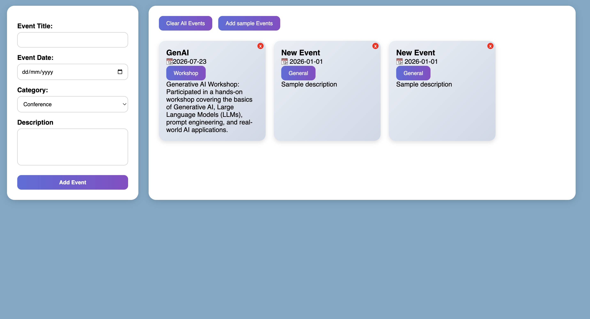

# 📅 Event Management System

A responsive **Event Management System** built using **HTML5, CSS3, and JavaScript**. The application allows users to create and organize events by entering an event title, selecting a date, choosing a category, and adding a description. Events are displayed dynamically, making event management simple and interactive.

---

## 📸 Preview

<p align="center">
  
</p>

> Place **screenshot.png** in the root directory of the repository.

---

## ✨ Features

- 📝 Add New Events
- 📅 Select Event Date
- 🏷️ Categorize Events
  - Conference
  - Workshop
  - Meetup
  - Webinar
  - Social Event
- 📄 Add Event Description
- 📋 Dynamic Event Display
- 🎯 Generate Sample Events
- 🗑️ Clear All Events
- 📱 Responsive User Interface

---

## 🛠️ Tech Stack

- HTML5
- CSS3
- JavaScript (ES6)

---

## 📂 Project Structure

```
Event-Management-System/
│
├── index.html
├── style.css
├── script.js
├── screenshot.png
└── README.md
```

---

## 🚀 Live Demo

🌐 **Live Website**

https://event-management-systm.netlify.app/

---

## ▶️ How to Run

1. Clone the repository

```bash
git clone https://github.com/suryaraghav2703-spec/event-management-system
```

2. Open the project folder.

3. Open **index.html** in any modern web browser or use **Live Server** in VS Code.

No installation or additional dependencies are required.

---

## 📚 What I Learned

- DOM Manipulation
- Event Handling
- Form Validation
- Dynamic UI Rendering
- JavaScript Arrays & Objects
- Responsive Web Design

---

## 🎯 Future Improvements

- 💾 Save Events using Local Storage
- ✏️ Edit Existing Events
- 🗑️ Delete Individual Events
- 🔍 Search & Filter Events
- 📆 Calendar View
- 🌙 Dark Mode

---

## ⭐ Support

If you found this project useful, please consider giving it a ⭐ on GitHub.

Feedback and suggestions are always welcome!
